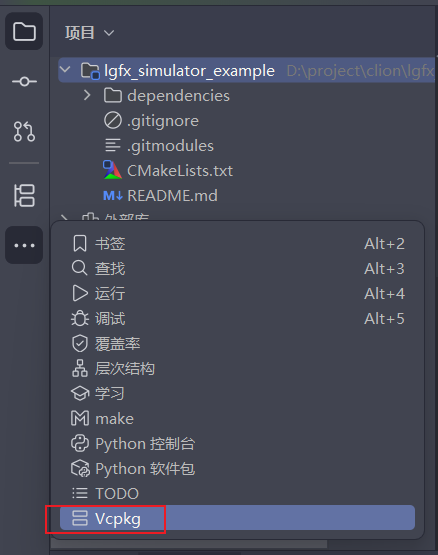
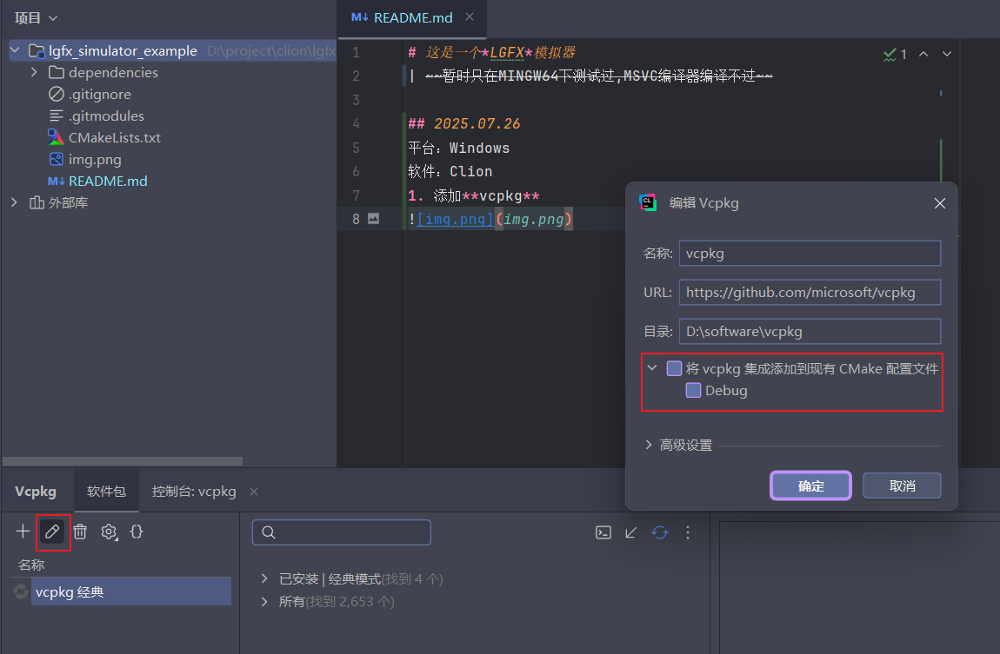
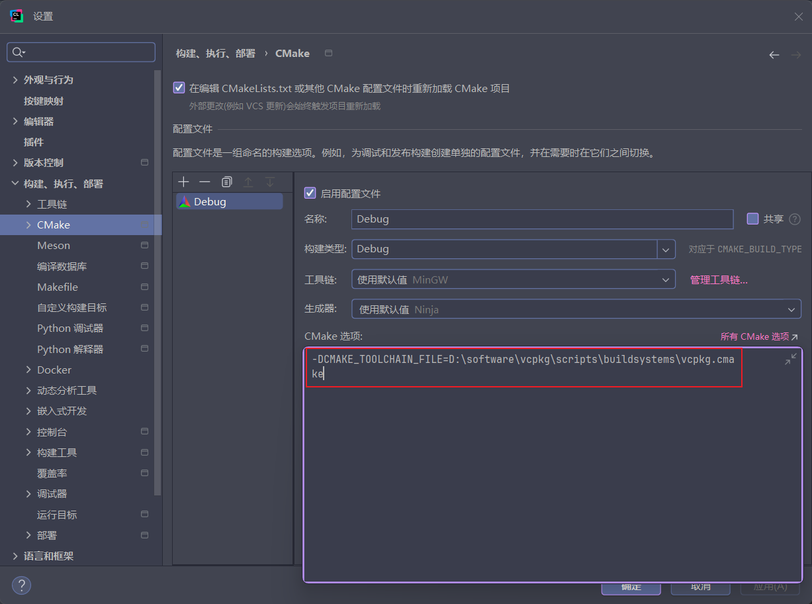
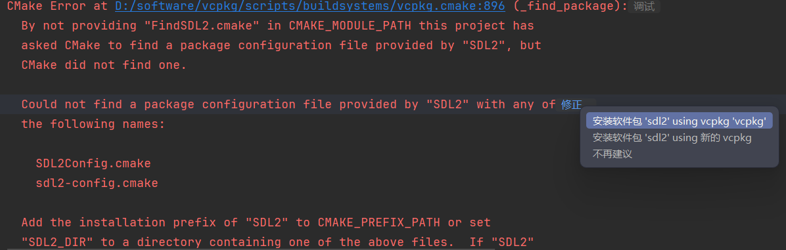

# 这是一个*LGFX*模拟器
| ~~暂时只在MINGW64下测试过,MSVC编译器编译不过~~

## 2025.07.26
平台：Windows  
软件：Clion
1. 使用**vcpkg**

2. 编辑**vcpkg**，将其集成到项目中

### 注意

集成到项目中后，vcpkg的triplet可能与安装的不一样，就会导致Cmake执行时报错（找不到）

选择修正里面的第一条就会自动安装所需包。